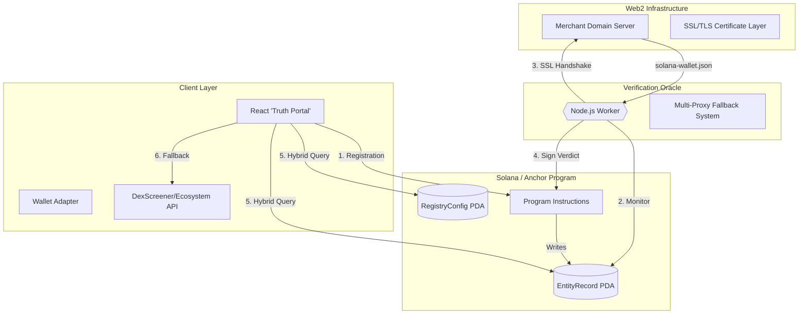
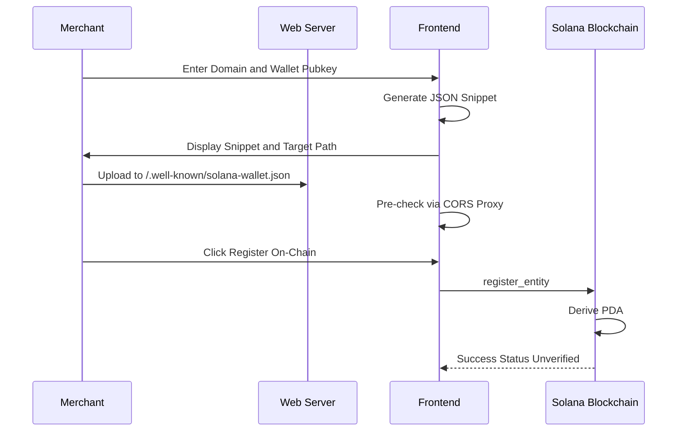
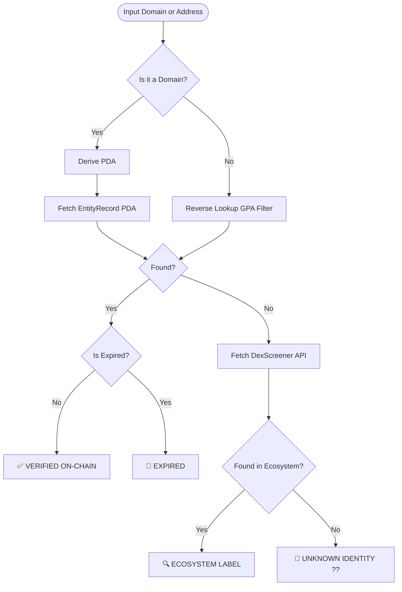
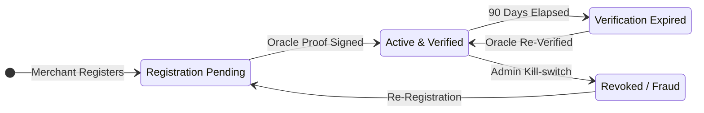
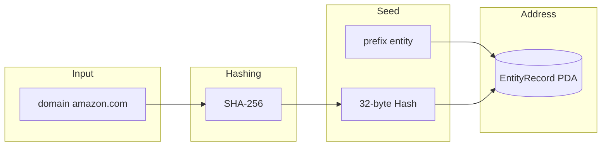
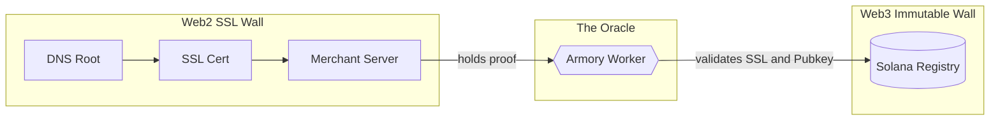

# Armory Protocol: The Agentic Web Identity Layer

Armory Protocol is a decentralized identity registry on Solana designed specifically for the **Agentic Web**. It provides a cryptographic bridge between Web2 domains (DNS) and Web3 wallets (Pubkeys), enabling AI agents and automated protocols to verify the authentic identity behind any on-chain address with 100% cryptographic certainty.

---

## 1. High-Level Architecture Design

The system is composed of four decoupled layers that interact seamlessly to maintain an immutable, trustless source of truth.

### System Topology

## 2. Component-Level Workflows

### A. Merchant Registration Flow
How a domain owner claims their on-chain identity.

### B. The 'Waterfall' Search Engine
The logic used by the UI and AI agents to resolve trust.

---

## 3. On-Chain State Management

### Entity Record Lifecycle

---

## 4. Account Structure & Indexing Blueprint

### PDA Seed Derivation

### Data Layout (Surgical Indexing)
| Offset | Field | Type | Description |
| :--- | :--- | :--- | :--- |
| 0 | Discriminator | `[u8; 8]` | Anchor Identifier |
| 8 | `domain_hash` | `[u8; 32]` | Fixed-offset index for GPA |
| **40** | **`official_pubkey`** | **`Pubkey`** | **Primary Reverse-Lookup Anchor** |
| 72 | `verification_status`| `bool` | Trust State |
| 73 | `expiration_epoch` | `i64` | Unix Expiry |

---

## 5. Security Model: The Trust Bridge

Armory tokenizes DNS trust onto Solana by bridging Web2 security (SSL) with Web3 immutability.

---

## 6. Technical Secret Sauce

1.  **Infinite Domain Support**: By hashing domains into SHA-256 seeds, we bypass Solana’s 32-byte seed limit, supporting any URL length.
2.  **Surgical Offsets**: Storing `official_pubkey` at exactly byte 40 enables ultra-fast, index-free reverse lookups directly on any RPC node.
3.  **Agent-First**: The architecture provides programmatic, on-chain truth designed for AI agents to consume via one instruction call.

---
**Armory Protocol — Turbin3 Q2 2026**
*The cryptographic source of truth for the Agentic Web.*
