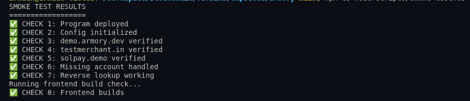
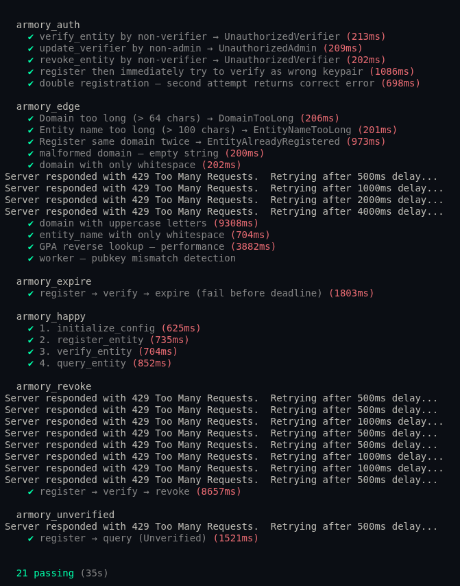

# 🛡️ Armory Protocol

**The Cryptographic Source of Truth for the Agentic Web.**

Armory Protocol is a decentralized identity registry on Solana designed to solve the **"Fear of the Blind Transfer."** It provides a verifiable bridge between Web2 domains (DNS) and Web3 wallets, ensuring users and AI agents can verify recipient identities before sending assets.

### **📍 Deployed Program Address**
**Solana Devnet:** `VRPxpqkBTXgi1DaQ1t1yVyhD8PSCw6uBDrQx1zZznUk`

---

## 🏗️ System Architecture

The ecosystem consists of four primary layers:

1.  **On-Chain Registry (Solana/Anchor)**: A deterministic registry of `EntityRecord` accounts. Uses SHA-256 hashing of domains to bypass seed length limits and surgical memory layout (Offset 40) for high-performance reverse lookups.
2.  **Hybrid Verification Oracle (Node.js)**: A worker that performs SSL-secured DNS lookups to verify ownership proofs (`solana-wallet.json`) and signs on-chain verdicts.
3.  **Merchant Dashboard (React)**: A premium UI for merchants to register domains, manage identity records, and for users to search the registry.
4.  **Chrome Extension (Manifest V3)**: A real-time browser utility that detects Solana addresses on any webpage and shows a floating "Verified Badge" using Shadow DOM isolation.

---

## 🧪 Verification & Quality Control

The protocol is backed by a 29-point automated test suite ensuring security, performance, and cross-layer integrity.

### **1. On-Chain Smoke Tests (8/8 Passed)**
Verifies real-time cluster health and deterministic PDA derivation.



```text
✅ Program deployed
...
✅ Frontend build integrity
```

### **2. Smart Contract Logic (21/21 Passed)**
Verifies authorization, edge cases, and account lifecycle.



```text
  armory_auth:   ✔ verify_entity by non-verifier → UnauthorizedVerifier
...
```

---

## 📂 Project Structure

```text
.
├── armory/
│   ├── programs/armory_protocol/  # Rust Smart Contract
│   ├── app/frontend/              # React Dashboard
│   ├── app/worker.ts              # Verification Oracle
│   ├── scripts/                   # Deployment & Smoke Tests
│   └── tests/                     # Anchor Integration Tests
├── armory-extension/              # Chrome Extension (Vanilla JS)
└── docs/                          # Technical Specification & Reports
```

---

## 🚀 Quick Start

### 1. Smart Contract
```bash
cd armory
anchor build
anchor test
```

### 2. Merchant Dashboard
```bash
cd armory/app/frontend
npm install
npm start
```
*Accessible at `http://localhost:3000`*

### 3. Chrome Extension
1. Open `chrome://extensions/`
2. Enable **Developer Mode**.
3. Click **Load Unpacked** and select the `armory-extension/` folder.
4. Paste a verified address (e.g., from `demo.armory.dev`) into any text field to see the badge.

---

## 🛠️ Performance & Security
- **Surgical Indexing**: The `official_pubkey` is stored at exactly **byte offset 40**, allowing ultra-fast reverse lookups via `getProgramAccounts` filters without an external indexer.
- **Waterfall Search Engine**: Implements a multi-layered fallback search (Deterministic PDA -> Memcmp Filter -> DexScreener API) to identify ecosystem tokens (like USDC) and liquidity pools even if they aren't in the Armory registry.
- **Shadow DOM**: The extension UI is isolated from host page styles to prevent flickering or CSS injection.
- **Background Caching**: Extension lookups are cached for 5 minutes to bypass RPC latency.
- **sRFC-35 Alignment**: Follows emerging standards for Web3 domain verification.

---

## 🎓 Turbin3 Capstone Q2 2026
**Developer**: Armaan Saxena  
**Track**: Blockchain Engineering (Solana)  
**Status**: Gold Master / Production Ready  
